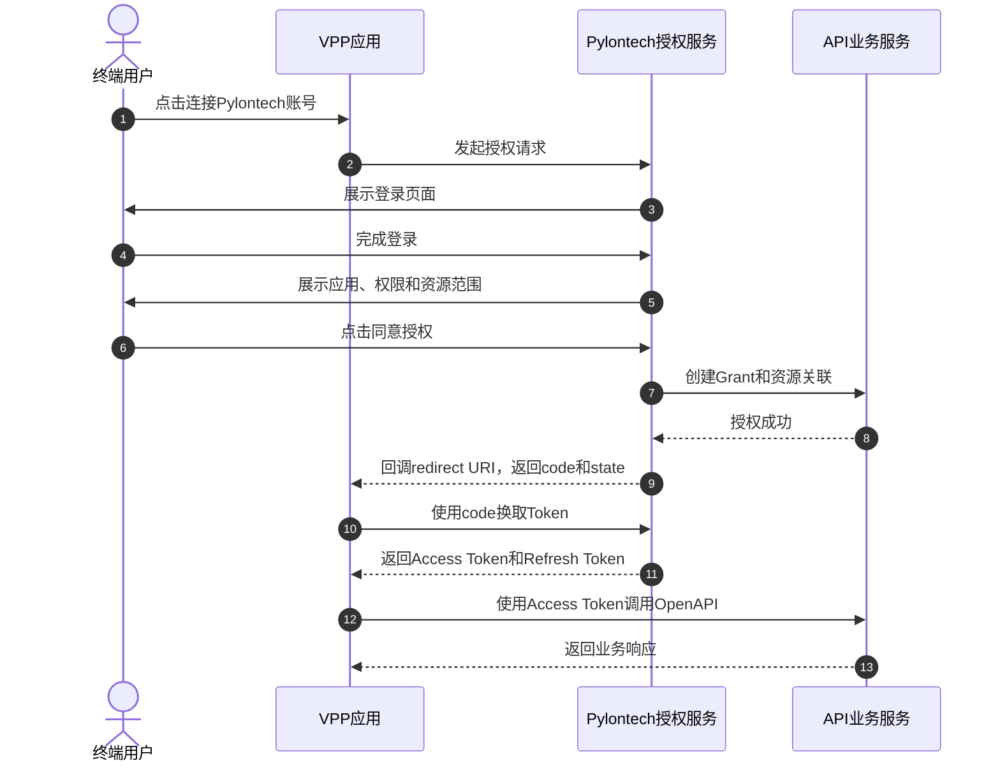

# Pylontech OpenAPI v1.2.1需求文档

## 1. 文档信息

| 项目 | 内容 |
| --- | --- |
| 产品 | Pylontech OpenAPI |
| 预期交付日期 | 2026-07-31 |
| 目标读者 | 产品、开发、测试、交付团队 |
| 文档用途 | 明确实现范围、接口数据模型规范、错误处理、OAuth2要求、验收标准 |

## 2. 基线与总体原则

### 2.1 当前公开功能基线

本需求以当前生产环境已经提供的v1.2.0 中的公开能力为基线：

*   Site：站点列表、站点详情。
    
*   Device：设备列表、设备详情。
    
*   Telemetry：设备最新遥测、批量最新遥测、设备历史遥测。
    
*   Energy：设备能量统计。
    
*   Fault & Alarm：设备故障与告警列表。
    
*   Command：单设备/批量调度命令、命令查询、命令取消。
    
*   Schedule：单设备/批量定时充放电策略。
    
*   Configuration：单设备/批量配置。
    

### 2.2 兼容性原则

*   已公开的 endpoint、data  schema、请求和响应字段、枚举值、返回码，不得在后续版本中无说明地删除或改名。
    
*   实现响应体必须与Developer Portal 网页中定义的 response schema 一致。
    
*   同一字段在列表、详情、单设备接口、批量接口中的类型、单位、枚举和 null语义必须一致。
    
*   不允许只修改 Developer Portal 示例而不修改API实现，也不允许只修改API而不更新Developer Portal，要保证生产环境发布的网页文档和API是同步更新的。
    
*   后续有别的OEM换皮逆变器接入云平台，必须通过内部适配层完成上下行语义统一，对外 API 接口名和字段保持不变。
    

### 2.3 术语

| 术语 | 定义 |
| --- | --- |
| ACC PV | 以AC耦合方式接入站点，不由当前储能逆变器直接控制的第三方光伏 |
| Resource Owner | Authorization Code 模式下授权设备访问权限的终端用户 |
| Service Client | 使用 Client Credentials 的 VPP 第三方应用 |
| Delegated Client | 使用 Authorization Code 代表终端用户访问资源的 VPP 第三方应用 |

## 3. API修改需求

### 3.1 统一响应体、HTTP 状态码、业务返回码和消息

#### 3.1.1 适用范围

本节适用于 `/api/openapi/v1` 下的业务 API。OAuth2 `/authorize` 和 `/token` 遵循 OAuth2 标准响应格式，无需使用业务 API envelope。

#### 3.1.2 删除字段

所有 API 的响应体必须删除以下三个字段：

```json
{
  "warn": false,
  "success": true,
  "error": false
}
```

#### 3.1.3 统一业务响应结构

成功和失败响应均保留统一 envelope：

```json
{
  "code": 200,
  "msg": "success",
  "data": {}
}
```

#### 3.1.4 正确示例

成功查询：

```json
HTTP/1.1 200 OK
{
  "code": 200,
  "msg": "success",
  "data": {
    "total": 4,
    "page": 1,
    "size": 20,
    "devices": []
  }
}
```

设备不存在：

```json
HTTP/1.1 404 Not Found
{
  "code": 404,
  "msg": "Resource not found",
  "data": null
}
```

#### 3.1.6 HTTP响应码列表（需要对齐 $\color{#0089FF}{@王邵焌}$  ）

| HTTP status | body `code` | 使用场景 | 默认 `msg` |
| --- | --- | --- | --- |
| 200 | 200 | GET/PUT 成功、同步处理成功、批量请求完成 | `success` |
| 202 | 202 | 单设备或批量命令已接收，执行结果需要后续查询 | `Command accepted` |
| 400 | 400 | JSON、query、path 参数格式错误或缺少必填参数 | `Bad request` |
| 401 | 401 | Token 缺失、无效、过期 | `Unauthorized` |
| 403 | 403 | Token 有效，但 scope 不足或不允许执行该操作 | `Forbidden` |
| 404 | 404 | 资源不存在；或为避免泄露资源存在性，资源不属于当前 Client | `Resource not found` |
| 409 | 409 | 当前资源状态与操作冲突，例如已完成命令不可取消 | `Conflict` |
| 422 | 422 | 请求语法正确，但超出设备能力或业务约束 | `Unprocessable entity` |
| 429 | 429 | 超过 rate limit | `Too many requests` |
| 500 | 500 | 未处理的服务端异常 | `Internal server error` |
| 503 | 503 | 下游设备/服务暂时不可用 | `Service unavailable` |

### 3.2 部分Site相关接口暂不公开

以下接口不出现在 v1.2.1 的Developer Portal 中：

*   `GET /sites/{siteId}/latestData`
    
*   `POST /sites/latestData/query`
    
*   `GET /sites/{siteId}/energy`
    
*   `POST /sites`
    
*   `DELETE /sites/{siteId}`
    

实现要求：

*   本版本不修改上述接口能力。
    
*   仅从Developer Portal 网页前端层面删除，不暴露给用户，不需要从API层面删除。
    
*   Developer Portal 不得通过菜单、搜索页面暴露这些接口。
    

### 3.3 API参数必须与 Developer Portal 定义一致

#### 3.3.1 总体规则

*   Developer Portal 定义了公开的字段名称和枚举值，API必须返回与定义一致的数据。
    
*   API实际返回体和网页示例必须使用完全相同的大小写，不允许存在大小写不敏感、空格、下划线等方式的错误值。
    
*   未识别的内部协议值不得直接返回到公开 API；必须按设计原则，明确 mapping 处理。
    

#### 3.3.2 重点枚举值举例

| 字段 | 公开值 |
| --- | --- |
| `Device.phaseType` | `singlePhase`, `threePhase` |
| `faultStatus` | `normal`, `fault`, `alarm` |
| `Alarm.alarmLevel` | `fault`, `alarm` |
| `Alarm.status` | `active`, `resolved` |
| `DeviceEnergyStatistics.period` | `day`, `month`, `year` |
| `CommandStatus.status` | `received`, `executing`, `completed`, `cancelled` |
| `SchedulePeriod.action` | `charge`, `discharge` |
| `DeviceConfiguration.operationMode` | `selfConsumption`, `feedInPriority`, `backupMode` |

#### 3.3.3 Command控制字段升级、弃用与兼容规则

v1.2.1新增`powerControl`作为command接口唯一对客户公开且推荐使用的功率控制字段，用于替代原有的`activePowerControl`和`reactivePowerControl`。

自v1.2.1起，`activePowerControl`和`reactivePowerControl`正式标记为deprecated。弃用不代表服务端立即删除：为保证存量客户的历史请求继续可用，API服务端仍须兼容这两个旧字段；但新客户接入和新增功能不得继续使用旧字段。

| 字段 | v1.2.1状态 | 服务端处理 | OpenAPI及Developer Portal展示 |
| --- | --- | --- | --- |
| `powerControl` | 当前字段 | 正常支持，作为后续接入标准 | 公开，并提供schema、说明和示例 |
| `activePowerControl` | Deprecated | 仅用于兼容存量客户 | 不公开，不出现在request/response schema及示例中 |
| `reactivePowerControl` | Deprecated | 仅用于兼容存量客户 | 不公开，不出现在request/response schema及示例中 |

请求校验规则：

*   同一个command请求对象只能选择新字段方案或历史字段方案。
    
*   `powerControl`不得与`activePowerControl`或`reactivePowerControl`同时传入；如同时传入，API必须按无效请求拒绝处理。
    
*   未传入`powerControl`时，服务端继续按历史接口规则处理`activePowerControl`和`reactivePowerControl`，两个历史字段之间允许按原有方式组合使用。
    
`powerControl`字段定义：

| 字段 | 类型 | 必填 | 取值/单位 | 作用 |
| --- | --- | --- | --- | --- |
| `targetBatteryPowerW` | integer | 否 | W；正数表示放电，负数表示充电，`0`表示目标功率为0 W | 设置命令有效时间段内的电池目标功率 |
| `chargeCutoffSocPercent` | integer | 否 | 0-100，单位% | 设置充电截止SOC；电池SOC达到该值后不得继续充电 |
| `dischargeCutoffSocPercent` | integer | 否 | 0-100，单位% | 设置放电截止SOC；电池SOC达到或低于该值后不得继续放电 |
| `operationMode` | string | 否 | `selfConsumption`、`feedInPriority`、`backupMode` | 设置命令有效时间段内的设备运行模式 |
| `siteImportLimitW` | integer | 否 | 0-1000000，单位W | 设置命令有效时间段内的站点最大进口功率限制 |
| `siteExportLimitW` | integer | 否 | 0-1000000，单位W | 设置命令有效时间段内的站点最大出口功率限制 |

六个子字段的关系及生效规则：

*   `powerControl`对象本身为必填，内部六个子字段均为可选，但每次请求至少必须传入一个子字段。
    
*   六个子字段彼此独立，不是单选关系，可以只传一个，也可以任意组合传入多个。
    
*   `targetBatteryPowerW`用于设置充放电目标，两个SOC字段用于限制允许充电和放电的SOC边界；`operationMode`用于设置运行模式；`siteImportLimitW`和`siteExportLimitW`分别限制站点从电网进口和向电网出口的最大功率。多个字段同时传入时共同生效，其中SOC截止条件和站点进出口功率限制会约束目标功率的实际执行。
    
*   传入的子字段仅在`startTime`至`endTime`定义的命令有效时间段内覆盖设备原有设置；未传入的子字段继续保持设备原有设置不变。
    
*   命令结束后，本次`powerControl`临时覆盖值不再生效，设备恢复按原有设置运行。
    

新的单设备command请求体：

```json
{
  "powerControl": {
    "targetBatteryPowerW": -2000,
    "chargeCutoffSocPercent": 95,
    "dischargeCutoffSocPercent": 10,
    "operationMode": "selfConsumption",
    "siteImportLimitW": 1000,
    "siteExportLimitW": 2000
  },
  "startTime": "2026-07-20T01:00:00Z",
  "endTime": "2026-07-20T02:00:00Z"
}
```

其中`-2000`表示以2 kW目标功率充电，充电至SOC 95%时停止；SOC 10%作为同一有效时间段内的放电下限；同时临时设置为自发自用模式，并将站点进口和出口功率分别限制为1000 W和2000 W。若本次只需要修改充电截止SOC，也可以只传一个子字段：

```json
{
  "powerControl": {
    "chargeCutoffSocPercent": 95
  },
  "startTime": "2026-07-20T01:00:00Z",
  "endTime": "2026-07-20T02:00:00Z"
}
```

新的批量command请求体：

```json
{
  "devices": ["device-001", "device-002"],
  "command": {
    "powerControl": {
      "targetBatteryPowerW": 2000,
      "dischargeCutoffSocPercent": 10
    },
    "startTime": "2026-07-20T01:00:00Z",
    "endTime": "2026-07-20T02:00:00Z"
  }
}
```


### 3.4 无功功率 var / kvar 单位换算

| 场景 | 字段/模式 | 对外单位 |
| --- | --- | --- |
| 设备静态能力 | `maxReactivePowerKvar` | kvar |
| 电表遥测 | `meter.gridReactivePowerKvar` | kvar |
| 逆变器遥测 | `inverter.reactivePowerKvar` | kvar |
| 命令模式 | `reactivePowerTargetVar` | var |

测试：检查API读数是否与modbus poll中显示的无功功率数值一致。kvar为单位的数值一般不会很大，不会出现1342 kvar这类数字。

### 3.5 Device detail 增加 `**gridConnected**`

接口：

*   `GET /devices/{deviceId}`
    

Data Schema：`DeviceDetail`。

字段定义：

| 字段 | 类型 | 必填 | nullable | 语义 |
| --- | --- | --- | --- | --- |
| `gridConnected` | boolean | 是 | 否 | `true`\=并网/on-grid，`false`\=离网/off-grid |

测试：设置设备为离网模式，检查`gridConnected`是否为`false`。设置设备恢复到自发自用模式，检查`gridConnected`是否为`true`。

### 3.6 `**includeDevices=false**` 时返回 `**devices: null**`

适用接口：

*   `GET /sites`
    
*   `GET /sites/{siteId}`
    

接口行为：

| 请求 | 站点下存在设备 | 返回 |
| --- | --- | --- |
| `includeDevices=true` | 是 | `devices: [{...}]` |
| `includeDevices=true` | 否 | `devices: []` |
| `includeDevices=false` | 任意 | `devices: null` |
| 未传 `includeDevices` | 按当前默认值 `true` | 同 `includeDevices=true` |

### 3.7 Device telemetry 的 `**thirdPartyPv**`

适用接口：

*   `GET /devices/{deviceId}/latestData`
    
*   `POST /devices/latestData/query`
    
*   `GET /devices/{deviceId}/historicalData` 
    

有 ACC PV 时：

```json
{
  "thirdPartyPv": {
    "powerKw": 0,
    "cumulativeGenerationKwh": 0
  }
}
```

无 ACC PV 时：

```json
{
  "thirdPartyPv": null
}
```

判断规则：

*   是否存在 ACC PV 必须依据设备拓扑或配置关系判断。
    
*   有 ACC PV 时返回实际的 `powerKw` 和 `cumulativeGenerationKwh`；两个字段单位分别为 kW、kWh。
    
*   无 ACC PV 时字段必须存在且值为 `null`，不能返回 `{}`，不能省略字段。
    

### 3.8 Device energy statistics 增加电网进出口电量

接口：

*   `GET /devices/{deviceId}/energy`
    

Data Schema：：`DeviceEnergyStatistics`

新增字段：

| 字段 | 类型 | 单位 | 语义 |
| --- | --- | --- | --- |
| `gridImportKwh` | number | kWh | 统计当前时间段区间从电网输入的电量 |
| `gridExportKwh` | number | kWh | 统计当前时间段区间向电网输出的电量 |

规则：

*   两个字段是区间统计值，不是累计总表读数。
    
*   数值正常情况下应为非负数。
    
*   聚合周期必须与请求 `period` 一致。
    
*   因 site energy statistics 暂不公开，本需求只修改 device energy statistics。
    

### 3.9 Device fault and alarm 按PCS协议映射

接口：

*   `GET /devices/{deviceId}/alarms`
    

字段：alarmLevel = fault | alarm | notice

规则：

*   后端按照PCS协议的故障/告警分类表，分类 `fault` , `alarm` , `notice`。
    
*   query 参数 `alarmLevel` 与 response `Alarm.alarmLevel` 使用相同枚举值。
    
*   不允许返回中文、数字等级、`warning`、`normal` 等未知枚举。
    

### 3.10 OAuth2 授权

#### 3.10.1 支持的两种模式

Pylontech OpenAPI 同时支持 Client Credentials 和 Authorization Code 两种模式，两者不得混用。

| 对比项 | Client Credentials | Authorization Code |
| --- | --- | --- |
| Client 类型 | Service Client | Delegated Client |
| 代表身份 | VPP 应用自身 | VPP 应用代表已授权的终端用户 |
| 是否需要用户参与 | 不需要 | 需要用户登录并确认授权 |
| 资源权限来源 | VPP 通过 Bind Site 获得站点权限，设备继承所属站点的授权 | 用户将其账号下符合条件的站点和设备授权给 VPP |
| Token 覆盖范围 | 当前 Client 已绑定的全部站点和设备 | 当前用户通过该 Client 授权的全部站点和设备 |
| Token 维护方式 | VPP 通常复用一个当前有效的 Access Token | 每名终端用户独立维护一套 Access Token 和 Refresh Token |
| Access Token 到期处理 | 重新申请 Access Token | 使用 Refresh Token 刷新 |
| 是否允许 Bind Site | 允许 | 不允许 |

#### 3.10.2 Client 注册规则

*   不同 VPP 客户不得共享同一个 `client_id` 或 `client_secret`。
    
*   同一家 VPP 的测试环境和生产环境必须使用不同的 Client 注册。
    
*   两种模式默认使用两个独立的 Client：
    
    *   Service Client 只允许使用 Client Credentials，并可以申请 Bind Site 权限。
        
    *   Delegated Client 只允许使用 Authorization Code，不具备 Bind Site 权限。
        
*   两个 Client 可以归属于同一个 VPP，但必须使用不同的 `client_id` 和密钥。
    

#### 3.10.3 Client Credentials

*   Access Token 代表 VPP 应用自身，不代表终端用户。
    
*   VPP 通过 Bind Site 获得站点及站点下设备的访问权。
    
*   一个当前有效的 Access Token 可以访问该 Client 已绑定且 scope 允许的全部站点和设备，不需要为每个站点或设备分别申请 Token。
    
*   Client Credentials 不签发 Refresh Token。Access Token 过期后，VPP 重新申请。
    
*   撤销 Access Token 只会使该 Token 失效，不会自动解除 Bind Site 关系。解除站点绑定需要使用独立的 Unbind Site 能力。
    

#### 3.10.4 Authorization Code

##### 3.10.4.1 授权规则

*   VPP 将用户跳转至 Pylontech 授权页面。
    
*   用户身份由 Pylontech 登录会话确定。
    
*   用户登录成功不等于授权成功。登录后必须展示 VPP 应用名称、申请的权限以及即将授权的站点和设备范围，由用户主动确认。（v1.2.1 不用支持只选择部分站点授权，后续版本实现）用户点击“同意”表示授权其账号下当前符合条件的全部站点和设备。
    
*   用户点击同意后，系统创建 `Client + Resource Owner + Grant + Site/Device + Scope` 的授权关系，生成 Authorization Code。
    
*   系统通过注册的 redirect URI 返回 `code` 和 `state`。
    
*   VPP 服务端使用 Authorization Code 换取 Access Token 和 Refresh Token。
    
*   一个用户的一条 Grant 可以覆盖该用户授权的多个站点和设备。
    
*   同一个 VPP 接入多个终端用户时，每名用户分别产生独立 Grant，并独立维护 Token。
    

##### 3.10.4.2 Authorization Code 时序




#### 3.10.5 站点资源冲突

v1.2.1 采用“站点资源先到先得”的独占授权规则：

*   站点是资源独占的最小单位，站点下设备继承站点授权。
    
*   同一站点同一时刻只能授权给一个有效 Client，不区分该 Client 使用哪种 OAuth2 模式。
    
*   Authorization Code 对用户账号下全部符合条件的站点执行整组授权，不允许部分成功。
    
*   并发授权同一站点时，只允许一个 Client 成功。
    

示例：

1.  用户 A 拥有站点 X、Y、Z。
    
2.  Service Client B 已通过 Bind Site 获得站点 X 的访问权。
    
3.  用户 A 尝试向 Delegated Client C 授权。
    
4.  因站点 X 已被占用，本次对 X、Y、Z 的整组授权全部失败，不得只向 Client C 授权 Y、Z。
    
5.  反之，如果 Delegated Client C 已获得 X、Y、Z，Service Client B 后续不得再绑定其中任何站点。
    

发生冲突时，不得产生部分资源关联、有效 Authorization Code 或有效 Token。回调返回 `access_denied`，并通过错误信息说明资源已被绑定。

#### 3.10.6 Token 刷新与撤销

##### 3.10.6.1 Refresh Token

*   Authorization Code 模式签发 Refresh Token。
    
*   Access Token 过期后，VPP 使用 Refresh Token 获取新的 Token。
    
*   刷新不得扩大原授权的权限或资源范围。
    
*   Grant 已撤销或 Refresh Token 已失效时，返回 `invalid_grant`，VPP 需要引导用户重新授权。
    

##### 3.10.6.2 Revoke Token

```http
POST /api/auth/oauth2/revoke
```

*   Authorization Code 模式下，撤销 Token 表示撤销该用户对当前 VPP 的整条 Grant：
    
    *   该 Grant 下的 Access Token 和 Refresh Token 立即失效。
        
    *   解除该 Grant 创建的全部站点和设备授权关系。
        
    *   相关资源可以重新授权给其他 Client。
        
*   终端用户也必须能够在 Pylontech 账号的授权管理页面解除某个三方应用的授权，结果与 VPP 主动撤销授权一致。
    
*   Token 已失效或已撤销时，重复调用撤销接口仍按成功处理。
    

#### 3.10.7 Scope

| Scope | 能力 | Client Credentials | Authorization Code |
| --- | --- | --- | --- |
| `openapi.uplink` | 查询站点列表和详情 | 有 | 有 |
| `openapi.downlink` | 查询设备列表和详情 | 有 | 有 |
| `site.bind` | 绑定站点 | 有 | 无 |

#### 3.10.8 Token 响应

*   Token 成功响应使用 OAuth2 标准字段：`access_token`、`token_type`、`expires_in`、`refresh_token`、`scope`。
    
*   Client Credentials 不返回 `refresh_token`；Authorization Code 返回 `refresh_token`。
    
*   OAuth2 响应不使用 `{code, msg, data}` 业务 API envelope。
    
*   OAuth2 失败响应使用 `invalid_client`、`invalid_grant`、`invalid_scope`、`unauthorized_client`、`access_denied` 等标准错误。
    
*   Token 有效期必须在 API 实现、OpenAPI、Developer Portal 和 SOP 中保持一致。
    

## 4. Developer Portal修改需求

### 4.1 部分Site相关接口暂不公开

以下接口不出现在 v1.2.1 的Developer Portal 中：

*   `GET /sites/{siteId}/latestData`
    
*   `POST /sites/latestData/query`
    
*   `GET /sites/{siteId}/energy`
    
*   `POST /sites`
    
*   `DELETE /sites/{siteId}`
    

### 4.2 补充Quick Start 使用指导    

### 4.3 补充Oauth2 授权说明

### 4.4 补充terms & condition 使用条款

### 4.5 补充command相关接口具体使用方法与含义

### 4.6 补充HTTP状态码和业务返回码和msg对应关系表

## 5. 验收标准

v1.2.1 只有在以下条件全部满足时可交付：

*   业务 API HTTP status、body 、code 和 msg 行为统一。
    
*   无 success/warn/error 等字段。
    
*   需要隐藏的接口，不暴露。
    
*   业务 API 字段名、enum、单位、null含义符合本 PRD。
    
*   OAuth2 两种流程的设备授权通过端到端测试。
    
*   OpenAPI、Developer Portal、测试环境和生产环境请求响应参数一致。
