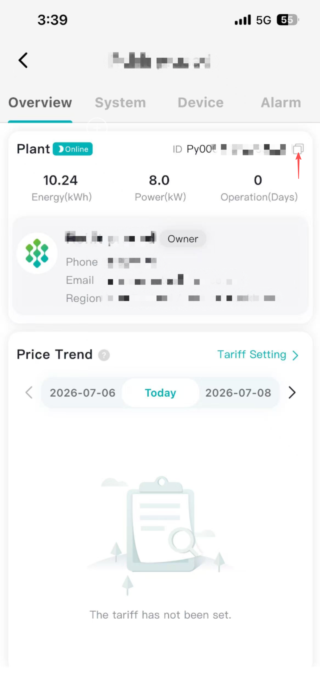

# API Usage SOP

## 1) Get Access Token (OAuth2 Client Credentials)

Use OAuth2 Client Credentials to get an `access_token` before calling any OpenAPI endpoint.

> Note: Pylontech OpenAPI does not currently support self registration.  
> To request `client_id` and `client_secret`, email technical support at:
> 
> - `zhao.kai@pylonttech.com.cm`
> - `yuan.zhiyan@pylontech.com.cn`
> 
> Default token expiry is 24 hours. Please manually call the token endpoint again to refresh/renew access.

- Method: `POST`
- Europe_URL: `https://openapi.pylontechcloud.com/api/auth/oauth2/token`
- Australia_URL: `https://openapi-au.pylontechcloud.com/api/auth/oauth2/token`
- Header: `Content-Type: application/x-www-form-urlencoded`
- Body (form-urlencoded):
  - `grant_type=client_credentials` (required)
  - `client_id=<your_client_id>` (required)
  - `client_secret=<your_client_secret>` (required)
  - `scope=<optional_scope>` (optional)

Example requets: 

```json
curl --location 'https://openapi.pylontechcloud.com/api/auth/oauth2/token' \
--header 'Content-Type: application/x-www-form-urlencoded' \
--data-urlencode 'grant_type=client_credentials' \
--data-urlencode 'client_id=YOUR-ID' \
--data-urlencode 'client_secret=YOUR-SECRET'
```

Example response:

```json
{
  "access_token": "eyJ...",
  "token_type": "Bearer",
  "expires_in": 3600,
}
```

Use this header in API calls:

`Authorization: Bearer {access_token}`

---

## 2) Bind Site Authorization (Need Site ID First)

Before data access, bind the site to your client.

### 2.1 Find Site ID

From the Plant Management page, copy the value in the **Plant ID** column (as shown below).



### 2.2 Bind Site

- Method: `POST`
- URL: `/v1/sites`
- Header:
  - `Authorization: Bearer {access_token}`
  - `Content-Type: application/json`
- Body:

```json
{
  "siteId": "your-site-id"
}
```

---

## 3) API Data Categories

### 3.1 Uplink Data (Read)

Uplink data is organized into two levels:

- **Site Level**
- **Device Level**

The available data types include:
1. Telemetry data (including voltage, current, power, energy, temperature, etc.)
2. Energy statistics (daily, monthly, and yearly aggregated energy data)
3. Device alarms

### 3.2 Downlink Data (Write)

Downlink data is organized in three types:

- **Configuration**
- **Command**
- **Schedule**

Key difference:

- **Configuration**: no time window. It is persistent and remains effective until updated (for example, site export limit).
- **Command**: has a time window (`startTime` to `endTime`). It is executed only within that specific period (for example, force battery charge/discharge).
- **Schedule**: a recurring charge/discharge plan defined by time windows and actions (for example, daily charge or discharge periods).